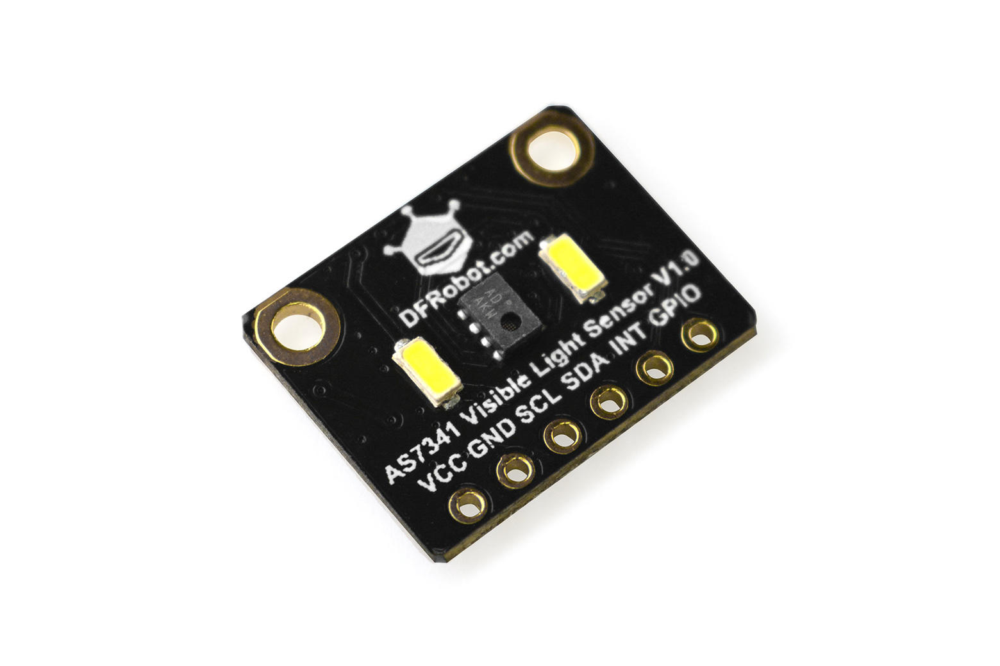
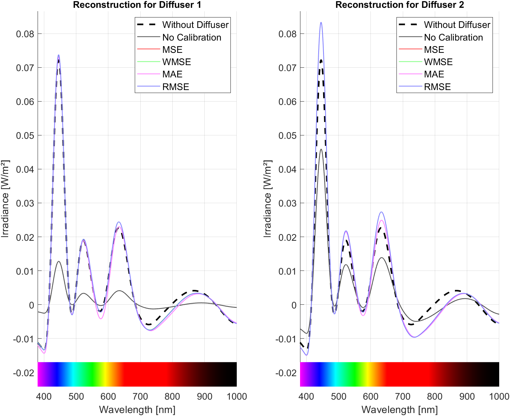

# LightSense-Calib: Spectral Calibration of the AS7341 Sensor

## 📌 Project Overview
This project is part of my **Undergraduate Thesis (TCC) at UFSM**, focusing on the calibration of a multi-channel light sensor, specifically the **OSRAM AS7341**. More details can be found in my thesis: [UFSM Repository](https://repositorio.ufsm.br/handle/1/32820).

### **🔧 AS7341 Sensor**
Below is an image of the AS7341 sensor used in this project:

---

## 🎯 Objective
The goal is to calibrate the AS7341 sensor by comparing its reconstructed spectral data with high-fidelity reference spectra obtained through an **integrating sphere**. The calibration algorithms aim to determine the best set of coefficients that minimize the error between the sensor's reconstructed spectrum and the reference spectrum.

---

## 🛠️ Hardware Used
The experimental setup consists of the following components:

- **Sensor**: OSRAM AS7341 (multi-channel spectral sensor)
- **Microcontroller**: Arduino (for reading and transmitting data via serial communication)
- **Integrating Sphere**: Used as a high-precision spectral reference
- **Computer**: Laptop running MATLAB for data processing

Image of the **experimental setup**, including the sensor inside the integrating sphere, the laptop running MATLAB, and other experiment components:

---

## 🔬 Calibration Process
The project includes three main MATLAB scripts:

### **1️⃣ channels_calib_no_diff.m**
- This script calibrates each of the **9 spectral channels** of the AS7341 sensor.
- Generates **calibration coefficients** for later use.
- Produces **graphs and images** detailing each step of the process.

  

### **2️⃣ channels_calib_with_diff.m**
- Uses the coefficients from the previous calibration.
- Calibrates the sensor **with a diffuser**, essential for ensuring accurate light measurements.
- Generates the **final coefficients** considering the diffuser.

  

### **3️⃣ sensor_processor.m**
- Receives sensor data and processes it **with or without calibration**.
- Displays measurements such as **Irradiance, Illuminance, and PPFD (Photosynthetic Photon Flux Density)**.

  

---

## 🏆 Calibration Methodology
Calibration data is obtained by comparing:
1. The **reconstructed spectrum from the AS7341 sensor**.
2. The **reference spectrum** of the same light source, measured inside an **integrating sphere** (a high-precision instrument).

The algorithms optimize the calibration coefficients to minimize errors between these two measurements.

### 📊 AS7341 Sensor Calibration Workflow  
The image below illustrates the sensor calibration process, highlighting the steps of coefficient optimization, R² validation, and result comparison with an integrating sphere:

---

## 📈 Evaluation Metrics
To assess calibration quality, the **coefficient of determination (R²)** was used to indicate how well the calibrated spectra fit the reference spectrum. Methods such as **Mean Squared Error (MSE), Mean Absolute Error (MAE)**, and **Weighted Mean Squared Error (WMSE)** were analyzed to determine the best calibration coefficients.

---

## 📜 More Information
For a detailed explanation of the methodology, results, and implementation, refer to my thesis: [UFSM Repository](https://repositorio.ufsm.br/handle/1/32820).
