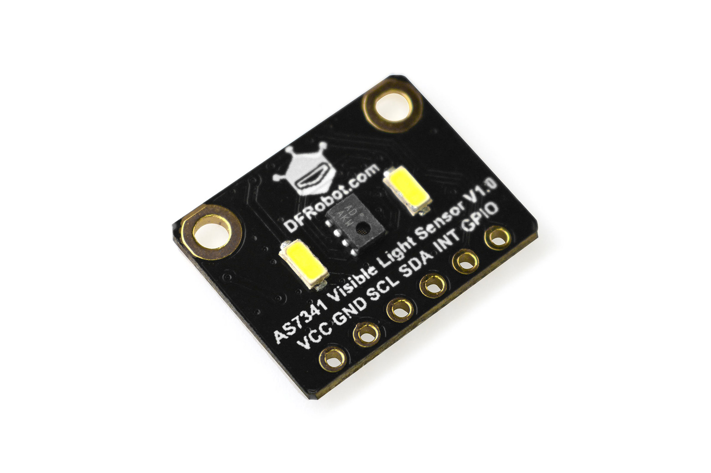
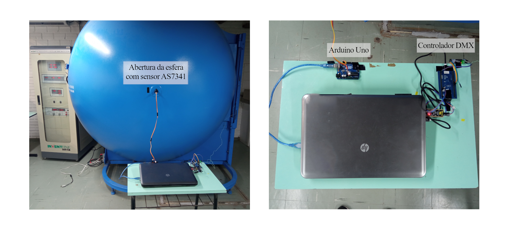
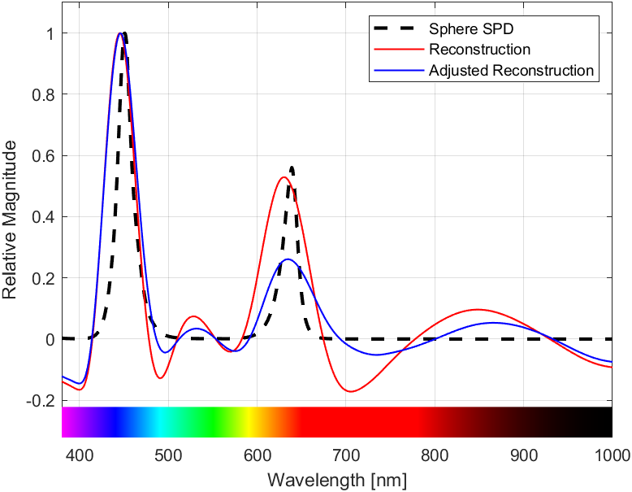
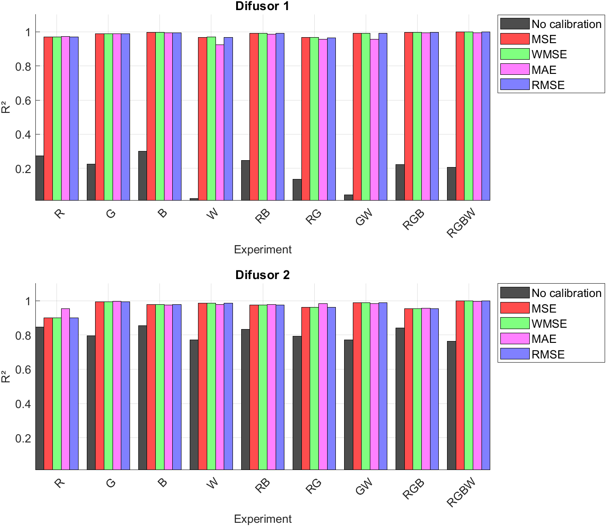
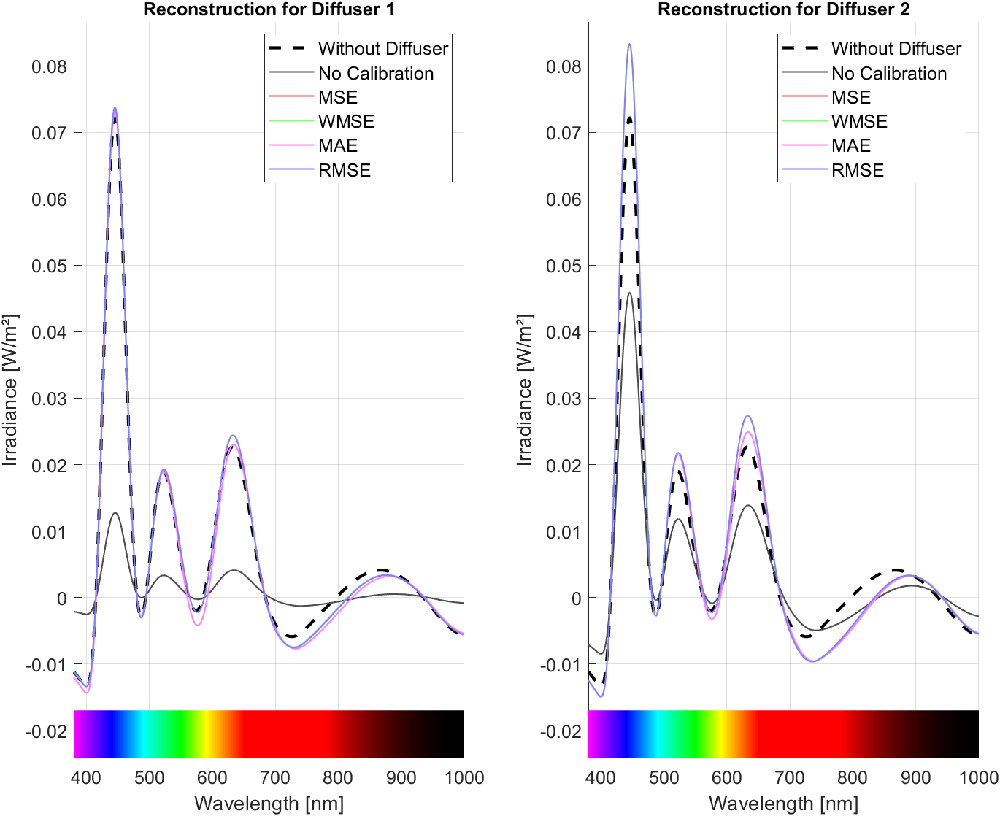
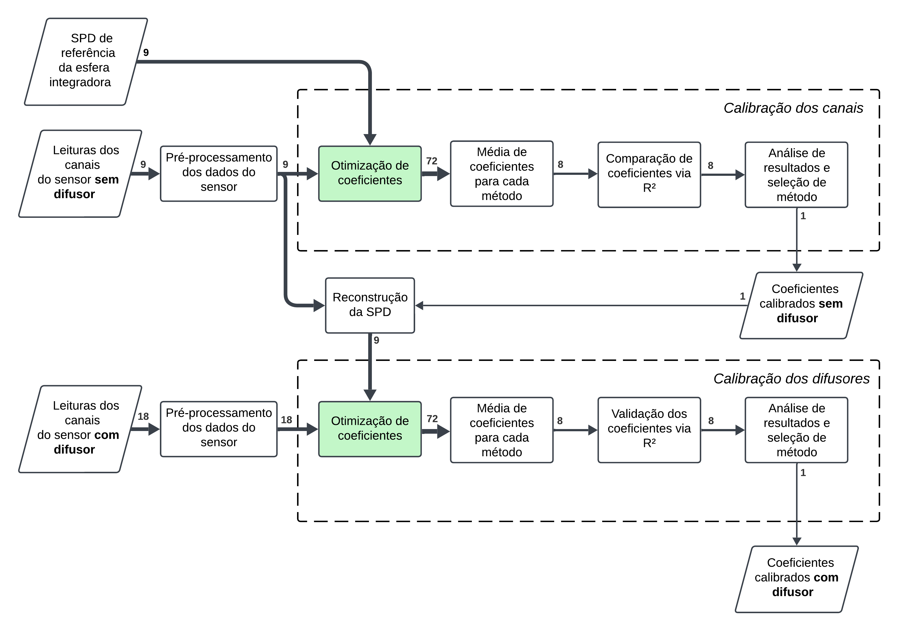

# LightSense-Calib: Calibração Espectral do Sensor AS7341

## 📌 Visão Geral do Projeto
Este projeto faz parte do meu **Trabalho de Conclusão de Curso (TCC) na UFSM**, focado na calibração de um sensor de luz multicanal, especificamente o **OSRAM AS7341**. Mais detalhes podem ser encontrados no meu TCC: [Repositório UFSM](https://repositorio.ufsm.br/handle/1/32820).

### **🔧 Sensor AS7341**
A seguir, uma imagem do sensor AS7341 utilizado no projeto:

---

## 🎯 Objetivo
O objetivo é calibrar o sensor AS7341 comparando os seus dados espectrais reconstruídos com espectros de referência de alta fidelidade, obtidos por meio de uma **esfera integradora**. Os algoritmos de calibração visam encontrar o melhor conjunto de coeficientes que minimizem o erro entre o espectro reconstruído pelo sensor e o espectro de referência.

---

## 🛠️ Hardware Utilizado
O setup experimental é composto pelos seguintes componentes:

- **Sensor**: OSRAM AS7341 (sensor espectral multicanal)
- **Microcontrolador**: Arduino (para leitura e envio de dados via serial)
- **Esfera Integradora**: Utilizada como referência espectral de alta precisão
- **Computador**: Notebook rodando MATLAB para processamento dos dados

Imagem do **setup de ensaios**, incluindo o sensor dentro da esfera integradora, o notebook rodando MATLAB e outros componentes do experimento:

---

## 🔬 Processo de Calibração
O projeto possui três scripts principais no MATLAB:

### **1️⃣ channels_calib_no_diff.m**
- Este script calibra cada um dos **9 canais espectrais** do sensor AS7341.
- Gera **coeficientes de calibração** para uso posterior.
- Produz **gráficos e imagens** detalhando cada etapa do processo.

  

### **2️⃣ channels_calib_with_diff.m**
- Utiliza os coeficientes da calibração anterior.
- Faz a calibração do sensor **com difusor**, essencial para garantir medições precisas de luz.
- Gera os **coeficientes finais** considerando o difusor.

  

### **3️⃣ sensor_processor.m**
- Recebe os dados do sensor e os processa **com ou sem calibração**.
- Exibe medidas como **Iluminância e PPFD (Densidade de Fluxo de Fótons Fotossintéticos)**.

  

---

## 🏆 Metodologia de Calibração
Os dados de calibração são obtidos por meio da comparação entre:
1. O **espectro reconstruído pelo sensor** AS7341.
2. O **espectro de referência** da mesma fonte de luz, obtido dentro de uma **esfera integradora** (equipamento de alta precisão).

Os algoritmos otimizam os coeficientes de calibração para minimizar os erros entre essas duas medições.

### 📊 Fluxo de calibração do sensor AS7341  
A imagem abaixo ilustra o processo de calibração do sensor, destacando as etapas de otimização dos coeficientes, validação via R² e comparação dos resultados com uma esfera integradora:

---

## 📈 Métricas de Avaliação
Para avaliar a qualidade da calibração, foi utilizado o **coeficiente de determinação R²**, que indica o quão bem os espectros calibrados se ajustam ao espectro de referência. Métodos como **Erro Médio Quadrático (MSE), Erro Médio Absoluto (MAE)** e **Erro Médio Ponderado (WMSE)** foram analisados para determinar os melhores coeficientes de calibração.

---

## 📜 Mais Informações
Para uma explicação detalhada da metodologia, resultados e implementação, consulte o meu TCC: [Repositório UFSM](https://repositorio.ufsm.br/handle/1/32820).

